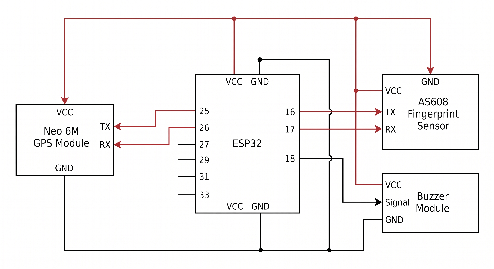

# UniRide AWS Configuration

Backend and hardware setup required for the UniRide System.

## Contents

| Section | Description |
|---|---|
| [About](#about) | Overview of this repository and related projects |
| [Requirements](#requirements) | Hardware and account prerequisites |
| [DynamoDB Setup](#dynamodb-setup) | Table structures to create manually |
| [Lambda Functions](#lambda-functions) | List of backend functions and their purpose |
| [IAM Setup](#iam-setup) | Role and permission configuration |
| [API Gateway](#api-gateway) | Route and integration setup |
| [GPS Module](#gps-module) | Wiring diagram for the hardware setup |

---

## About

This repository contains the initial setup required for the UniRide front-end (web and mobile applications) to work properly, along with the circuit diagram for the GPS module.

| Project | Repository |
|---|---|
| UniRide | [lynx7843/UniRide](https://github.com/lynx7843/UniRide) |
| UniRide Mobile | [lynx7843/UniRide_mobile](https://github.com/lynx7843/UniRide_mobile) |
| UniRide Client | [lynx7843/UniRide_client](https://github.com/lynx7843/UniRide_client) |

---

## Requirements

- AWS Cloud Server Account
- ESP32 Dev Board
- Neo 6M GPS Module
- AS608 Fingerprint Sensor
- Active-Low Buzzer Module
- Jumper Wires
- USB Data Cable

---

## DynamoDB Setup

Manually create the following tables with the listed structure using the given JSON files. All other attributes required by the tables will be auto-filled by the Lambda functions when entering data.

**Bookings**
```json
{
  "bookingId": {
    "S": ""
  }
}
```

**DriverDetails**
```json
{
  "driverId": {
    "S": ""
  }
}
```

**DriverFingerprints**
```json
{
  "driverId": {
    "S": ""
  }
}
```

**DriverVerification**
```json
{
  "trackerId": {
    "S": ""
  },
  "timestamp": {
    "N": "0"
  }
}
```

**GPSTrackerData**
```json
{
  "deviceId": {
    "S": ""
  },
  "timestamp": {
    "N": "0"
  }
}
```

**ShuttleDetails**
```json
{
  "shuttleId": {
    "S": ""
  }
}
```

**ShuttleStatus**
```json
{
  "shuttleId": {
    "S": ""
  }
}
```

**ShuttleStops**
```json
{
  "shuttleId": {
    "S": ""
  }
}
```

**Staff**
```json
{
  "email": {
    "S": ""
  }
}
```

**Users**
```json
{
  "email": {
    "S": ""
  }
}
```

---

## Lambda Functions

The source code for each Lambda function is available in the `AWS code` folder of this repository. The table below summarizes the purpose of each function.

| Function | Purpose |
|---|---|
| UpdateShuttleStatus | Updates the status of a shuttle in ShuttleStatus |
| RegisterShuttle | Registers a new shuttle in ShuttleDetails |
| GetDrivers | Retrieves driver records from DriverDetails |
| SaveLocation | Saves GPS tracker location data to GPSTrackerData |
| UpdateUser | Updates user details in Users |
| GetShuttleStops | Retrieves shuttle stop data from ShuttleStops |
| GetShuttleStatus | Retrieves shuttle status from ShuttleStatus |
| CreateBooking | Creates a new booking in Bookings |
| GetFingerprint | Retrieves stored fingerprint data from DriverFingerprints |
| GetLocations | Retrieves GPS tracker location data |
| LogFingerprint | Logs fingerprint verification attempts |
| CancelBooking | Cancels an existing booking in Bookings |
| RegisterDriver | Registers a new driver in DriverDetails |
| RegisterFingerprint | Saves fingerprint metadata to DriverFingerprints |
| LoginUser | Authenticates a user, staff member, or driver by email and password |
| GetUserBookings | Retrieves bookings belonging to a specific user |
| RegisterUser | Registers a new user in Users |
| GetShuttles | Retrieves all shuttle records from ShuttleDetails |

---

## IAM Setup

1. Go to the configuration tab on the Lambda Function page.
2. Navigate to the permissions sub-section.
3. Click on the Role name link.
4. Click Add permissions, then Attach Policies.
5. Search for AmazonDynamoDBFullAccess and add the permission.

---

## API Gateway

1. Search for API Gateway in the AWS console.
2. Create an API and give it a name (example: GPS_API).
3. Under Routes, click Create.
4. Give the API route a name reflecting its Lambda function and select the appropriate method.
5. Click on the method assigned to that route.
6. Click Attach Integration, then select the Lambda function from the dropdown menu. Confirm to save.

---

## GPS Module


